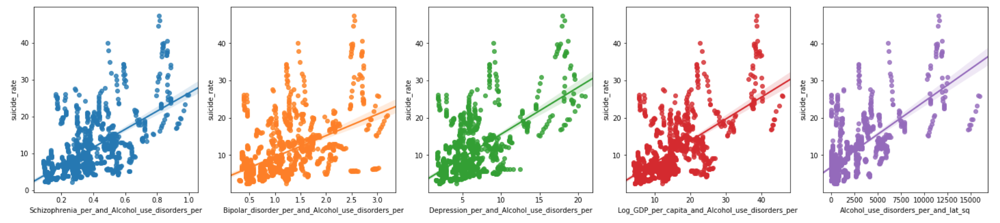
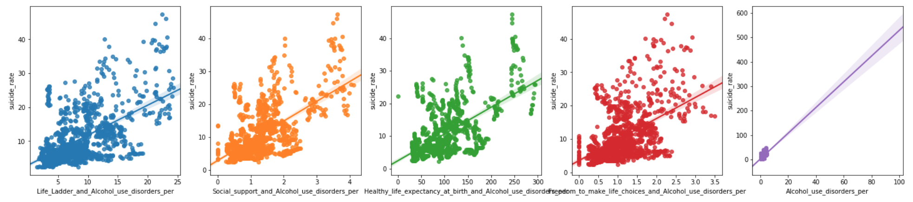
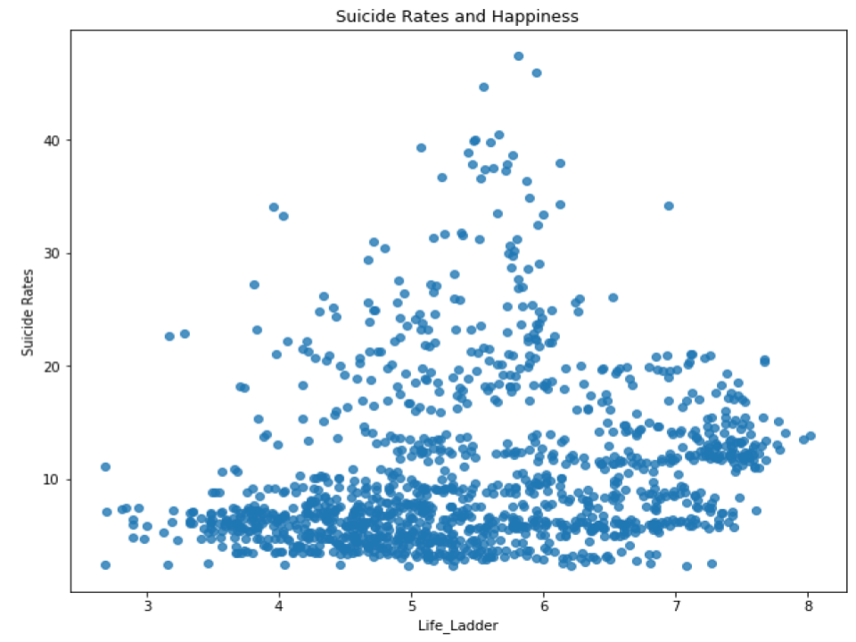
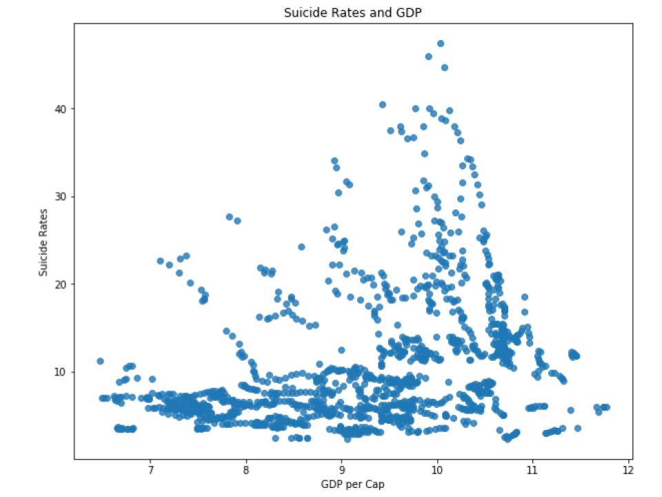
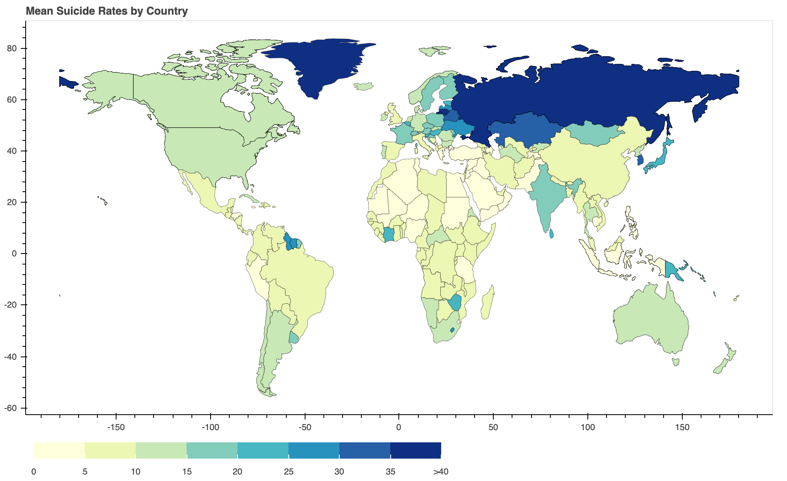

# Final Project for Linear Regression
## Contributors:
- Wayne Lam
- Omar Hussain

## Data Sources:
- Suicide rates by country and year from: http://ghdx.healthdata.org/gbd-results-tool
- UN WHR from Kaggle by user: Alcides Oxa
- Capitals and lat,long from: https://www.jasom.net/list-of-capital-cities-with-latitude-and-longitude/
- Mental Health Disorders from: https://github.com/Botafogo1894/Project2/blob/master/mental_disorder_substance_use.csv
- Vector data for countries from: https://www.naturalearthdata.com/downloads/110m-cultural-vectors/

## EDA and Data Visualizations:
- Relevent Features: Alcohol Interactions Scatterplots

- Less Relevent Features: Certain Happiness Metrics

- World Suicide Rates (mean over 2005-2016)

## Feature Engineering:
- Log GDP/Capita (already in UN WHR) and Log Suicide Rate
- Feature Interactions with R^2 > 0.1 (13 out of 24 are alcohol dependency related)

## Feature Selection and Model Selection:
- Wrapper Method (Recursive Feature Selection) to select features
- Embedded Method (Lasso Regression) to select features
- GridSearch for hyperparameter tuning for regularized regressions
- Ridge Regression generally had the highest R^2 score and lowest RMSE: 0.628, 4.211 respectively with mean 10.459, std 7.274

